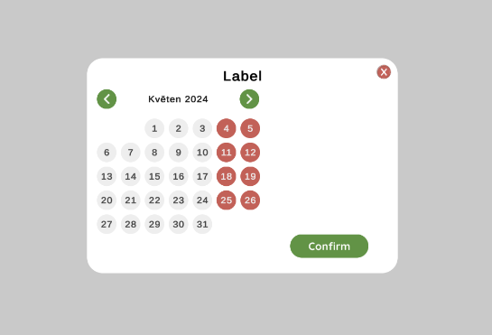
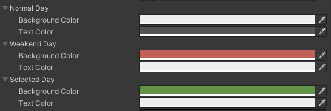

# Unity Simple Calendar
A simple UI calendar for unity



# Installation Guide

1. **Download**: Grab the latest package from the [releases page](https://github.com/yourusername/yourrepository/releases).
2. **Import**: Import the package into your project (tested on version 2021.3.14f1)

# How to use
1. **Integrate the Calendar Prefab**:
   - Drag the Calendar prefab into a Canvas within your scene.

2. **Access the Calendar from a Script**:
   - Once the Calendar is part of your scene, you can invoke it from any script using the following method:
   ```csharp
   async void GetDateFromCalendar()
   {
       DateTime dateTime = await Calendar.GetCalendar();
       Debug.Log($"Selected date and time: {dateTime}");
   }
   ```
   note that the method you call this from has to be async
   
# Styling
You can customize the calendar's day appearance with provided script styling options.
Just change the colors in the script inspector.




